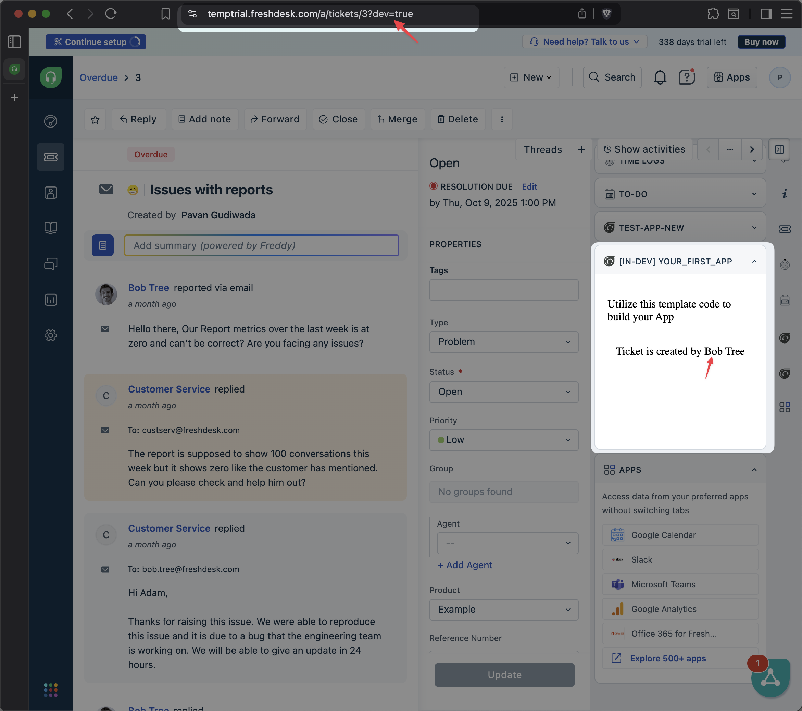

# Creating your first app
This app displays the name of the requester of a freshdesk ticket in the ticket_sidebar placeholder

## Getting Started

1. Ensure you have followed the steps given in [getting started guide](../../step-1/getting_started.md)
2. Navigate to `common-starter-template` directory from CLI  
3. Run command `fdk run` to run the app
4. Navigate to your product page - https://[subdomain].[product].com/a/dashboard/sample Eg: https://paidappdemo.freshdesk.com/ 
   1. Navigate to a specific ticket - https://[subdomain].[product].com/a/tickets/[id] Eg.https://paidappdemo.freshdesk.com/a/tickets/3
   2. Append `?dev=true` or `&dev=true` in URI to include query param For example
   3. When to use when there is no query param in URI
    `https://paidappdemo.freshdesk.com/a/tickets/3?dev=true`
   4. To use when there is already a URI query param is present 
    `https://paidappdemo.freshdesk.com/a/tickets/3?current_tab=details&dev=true` 

## Files and Folders

    ├── README.md               A file for your future self and developer friends to learn about app
    ├── app                     A folder to place all assets required for frontend components
    │   ├── index.html          A landing page for the user to use the app
    │   ├── scripts
    │   │   └── app.js          JavaScript to place files frontend components business logic
    │   └── styles              A folder to place all the styles for app
    │       ├── images
    │       │   └── icon.svg
    │       └── style.css
    ├── config                  A folder to place all the configuration files
    │   └── iparams.json
    ├── log                     A folder to place all the log files generated during development
    │   └── fdk.log
    └── manifest.json           A JSON file holding meta data for app to run on platform
    6 directories, 8 files

## Core Concepts Used
1. **Modules**: A module is a functional unit that defines where and how your app will run within one or more Freshworks products. Like [support_ticket](https://freshworks.dev/docs/app-sdk/v3.0/support_ticket/introduction/) for Freshdesk, [service_ticket](https://freshworks.dev/docs/app-sdk/v3.0/service_ticket/introduction/) for Freshservice, [common](https://freshworks.dev/docs/app-sdk/v3.0/common/introduction/) module for shared functionality, etc.
2. **Placeholders**: Placeholders are predefined areas within the Freshworks product UI where your app can be rendered. This could be the ticket sidebar, contact sidebar, etc. You can have a single app render in multiple placeholders too.

In this example 
1. The app supports [`support_ticket` module](https://freshworks.dev/docs/app-sdk/v3.0/support_ticket/introduction/) which is specific to Freshdesk. You can find this info in the `manifest.json` file.
2. We will use the [`ticket_sidebar` placeholder](https://freshworks.dev/docs/app-sdk/v3.0/support_ticket/front-end-apps/placeholders/#ticket_sidebar) to display our app in the individual ticket sidebar.

## How it works

1. After the app is loaded, it listens to the `app.activated` event to know when a user opens the app.
2. On receiving the event, it fetches the ticket details using the `client.data.get('contact')` method.
3. Then it extracts the requester's name and displays it in a text element by the id `app_text` using DOM manipulation.

## Demo
Here's how the app looks when running in the ticket sidebar:

