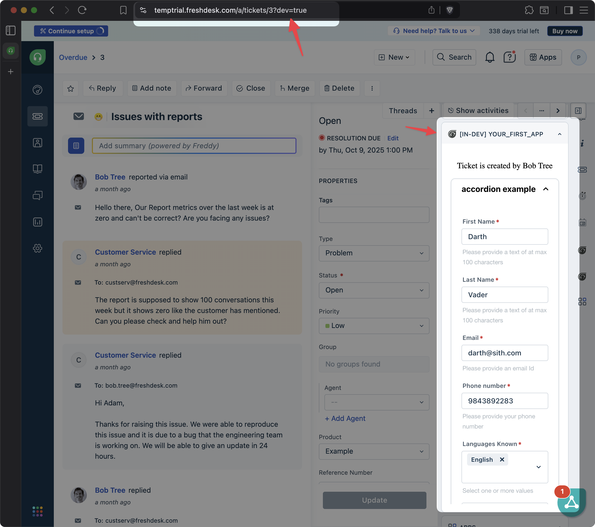

# App with Crayons components and Instance method

In this step, we will create an app that uses the [Freshworks Crayons](https://crayons.freshworks.com/) components and [instance methods](https://freshworks.dev/docs/app-sdk/v3.0/common/advanced-interfaces/instance-method/) to display a form inside the ticket sidebar.

## Getting Started

1. Ensure you have followed the steps given in [getting started guide](../../step-1/getting_started.md)
2. Navigate to `common-starter-template` directory from CLI  
3. Run command `fdk run` to run the app
4. Navigate to your product page - https://[subdomain].[product].com/a/dashboard/sample Eg: https://paidappdemo.freshdesk.com/ 
   1. Navigate to a specific ticket - https://[subdomain].[product].com/a/tickets/[id] Eg.https://paidappdemo.freshdesk.com/a/tickets/3
   2. Append `?dev=true` or `&dev=true` in the URI to include query param For example
   3. Use when there are no query params in the URI
    `https://paidappdemo.freshdesk.com/a/tickets/3?dev=true`
   4. Use when the URI has query params
    `https://paidappdemo.freshdesk.com/a/tickets/3?current_tab=details&dev=true`

## Core Concepts Used
1. **Crayons components**: Crayons components will help us create UI elements that are consistent with the Freshworks design system.
2. **Instance methods**: All sidebar apps have a default size of 300px height with a maximum of 700px height. The instance method will allow us [resize the app](https://freshworks.dev/docs/app-sdk/v3.0/common/advanced-interfaces/instance-method/#resize-an-instance) to fit our form.

## How it works
1. Import Crayons as a JS module in our `index.html` to use Crayons components.
2. Identify the form fields required and create a simple HTML form using Crayons components. Add validations where necessary and a submit button.
3. Since we have many fields, we will use the instance method to resize the app when the form is opened.

## Demo
Here's how the app looks when running in the ticket sidebar:   
