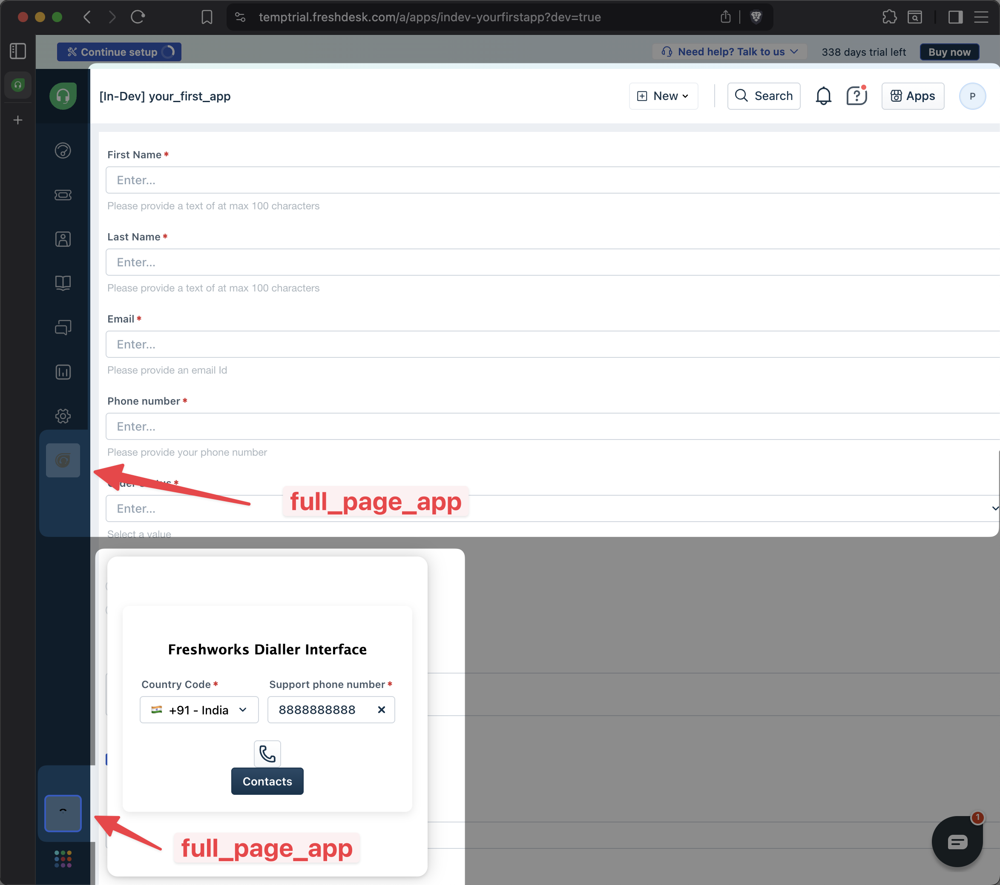

# App with separate Full Page App and CTI Global Sidebar App
In this step, we'll update the previous app to display different content when accessed as a Full Page App and CTI Global Sidebar App.

## Getting Started
1. Ensure you have followed the steps given in [getting started guide](../../step-1/getting_started.md)
2. Navigate to `common-starter-template` directory from CLI  
3. Run command `fdk run` to run the app
4. Navigate to your product page - https://[subdomain].[product].com/a/dashboard/sample Eg: https://paidappdemo.freshdesk.com/ 
5. Append `?dev=true` in your URI query params
6. From global sidebar open full page app and CTI app to test the changes
7. Explore the app placeholders defined in `manifest.json`. The app must be visible under all of the defined placeholders

## Core Concepts Used
**Common Placeholders**: All Freshwork products have a common left side bar that's always displayed in every page. This sidebar can be used to render apps that need to be accessible globally across the product. This can be done using:

1. `full_page_app` placeholder: This placeholder allows the app to be rendered as a full-page application within the Freshworks product.
2. `cti_global_sidebar` placeholder: This placeholder allows the app to be integrated

**Individual content for placeholders**: Each placeholder has its own size and context. Users can take advantage of this to provide different content and functionality based on where the app is being accessed from. For example, a full-page app can provide a detailed interface, while a sidebar app can offer quick access to essential features.

## How it works
1. First we create two new HTML files `full_page_app.html` and `cti_global_sidebar.html` inside the `views` folder to define the UI for the respective placeholders.
2. In `full_page_app.html`, we create a form that get's user data with additional information from the previous example.
3. In `cti_global_sidebar.html`, we create a simple dial pad interface that allows users to input a phone number and initiate a call.
4. Next in the app manifest(`manifest.json`) we add `full_page_app` and `cti_global_sidebar` placeholders to the common module like below:
    ```json
        "common": {
        "location": {
            "full_page_app": {
            "url": "views/full_page_app.html",
            "icon": "styles/images/icon.svg"
            },
            "cti_global_sidebar": {
            "url": "views/cti_global_sidebar.html",
            "icon": "styles/images/dial_pad.svg"
            }
        }
    ```

Note: These are non-functional examples created just to demonstrate the usage of these placeholders.

## Demo
Here's how the app looks in different placeholders:

