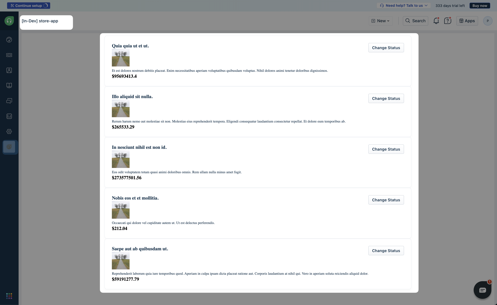

# Building a simple Ecommerce App with Fake Product API API

[Fake Product API](https://fakerapi.it/) is a Fake store rest API for your e-commerce or shopping website prototype.

We will be using [Products](https://fakerapi.it/products) endpoint for our use case

## Getting Started

1. Ensure you have followed the steps given in [getting started guide](../../step-1/getting_started.md)
2. Navigate to `store-app` directory from CLI  
3. Run command `fdk run` to run the app
4. Navigate to your product page - https://[subdomain].[product].com/a/apps/indev-storeapp?dev=true Eg: https://paidappdemo.freshdesk.com/a/apps/indev-storeapp?dev=true
5. Verify your app changes


## Core Concepts Used

**Request Template**: Freshworks FDK allows you to define external API requests in `config/requests.json` file. This helps in managing and reusing API requests across the app. You do not need to use any 3rd party libraries like **axios** or **fetch** to make API calls. You can define the request once in the `requests.json` file and use it wherever needed in your app using the `client.request.invokeTemplate()` method.

**Installation parameters(iparams)**: Installation parameters allow you to configure your app during installation. These parameters can be used to store API keys, URLs, or any other configuration data required by your app. In this example, we will use an installation parameter to store the base URL of the Fakerapi URL. You can define installation parameters using the `config/iparams.json` file.

## How it works
1. In the `config/iparams.json` file, we define an installation parameter `hostDomain` to store the base URL of the Fakerapi.
2. Create a file called `config/requests.json` and define a request template called `fakeStoreGetProducts` that uses the `hostDomain` iparam to construct the full URL for the products endpoint.
    ```json
        {
        "host": "<%= iparam.hostDomain %>",
        "path": "/api/v2/products?_quantity=5&_locale=en_IN"
        }
    ```
3. Use `fdk run` command to start the app.
4. Go to `http://localhost:10001/custom_configs` to see the test iparam configuration page. Add `fakerapi.it` as the Host Domain value and install the app.
5. Next go to your Freshdesk app and click the store-app icon from the left sidebar.
6. You'll see the full_page_app placeholder rendering a list of products fetched from the Fakerapi.

## Demo Screenshot
Here's an example of how the full page app might look:
